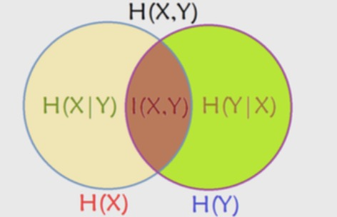

# 熵
出该系列的文章，主要是为了能够将相关的知识串联起来，而不是知识点和知识点之间去分裂的

熵在俩个领域都有定义，信息论中的意义和在计算机编码中的物理含义。

## 一、基础概念

## 1.1熵

随机变量不确定性的度量。

## 1.1.1 定义是如何来的

**信息量**：

* 当观测到随机变量的一个样本时，越不可能的事情发生来，则有越多的信息
* 随机变量x和y是相互独立的，那么分别观测到俩个变量得到的信息量和同时观测俩个变量的信息量是相同的。从概率上讲，意味着p(x,y) = p(x)+p(y)。那么可能的信息量为

$$h(x)=-log_a(x)$$

信息量只能衡量单个事件的信息量，一般而言整个系统呈现的是一个分布

**信息熵**：

用熵来评价整个随机变量 平均的信息量，而平均最好的度量就是随机变量的期望。

所以熵的公式定义为

$$H(X)=-\sum_{i=1}^np_ilog_a p_i$$

其中a可以取任意值。想更加深入的了解熵是如何定义来的，可以查看香农的信息论，或者网上查找熵的唯一性定理，，此处有他人的连接[熵的唯一性定理](https://zhuanlan.zhihu.com/p/36311131)

### 1.1.2 熵的其他理解

除了是对随机变量不确性的度量外，还有一个其他的理解方式，熵是平均意义上对随机变量的编码长度。理由为如下：

$$H(X) =-\sum p(x)logp(x)=\sum p(x)log \frac{1}{p(x)}=E[log \frac {1}{p(x)}] $$

即，熵实际上是随机变量X的函数$log\frac{1}{p(X)}$的期望，而根据1.1.1中的解释，$$log\frac{1}{p(X)}$$为信息量。

>  在香农于1948年发现的香农编码定理为如下[香农编码定义](https://blog.csdn.net/P081513083/article/details/96390147):
>
> 给定信源$X=\{x_i\}$以及概率分布P(X)，进行某种无损K进制编码后得到$C=\{C_i\}$,则
>
> $$\frac{H(X)}{log_aK}\leq E[L]\leq\frac{H(X)}{log_aK}+1$$
>
> 其中L为进行编码后随机编码C的长度。该定理说明，X进行无损编码后平均编码长度大于等于以K为底的信息熵
>
> 注：$$\frac{H(x)}{log_aK}$$相当于更换H(X)的底为K，推导可以查看log函数的换底公式

哈夫曼编码和香农编码定理的关系：基于香农编码定理思想，哈夫曼于1952年提出一种无损二进制编码方法，属于熵编码的一种，为带权路径最短的二叉树。 

**最短的平均编码长度 = 信源的不确定程度 / 传输的表达能力。**

其中信源的不确定程度，用信源的熵来表示，又称之为被表达者，传输的表达能力，称之为表达者表达能力，如果传输时有两种可能，那表达能力就是$$\log_22=1$$，如果是传输时有三种可能，那表达能力就是$$log_23$$，具体可以参考[熵和编码](https://blog.csdn.net/hearthougan/article/details/77774948)。因为计算机中都是二进制表示，所以一般除数为1，且需要的信息量称为bit。

## 1.1.2 熵的特点

* 熵只依赖于X的分布，与X的取值无关
* 熵越大，随机变量的不确定就越大

## 1.2 熵的拓展

此处在进行讲解时，会结合一些具体的场景，因为很多知识点不知道场景时，学习的方式只会过一遍，而串不起来。

熵的其他的概念有一个很经典的venn图，如下图所示

### 1.2.1 联合熵

先说联合熵，是因为联合熵的表达方式按照定义就可以写出来

俩个随机变量X,Y的联合分布，可以形成联合熵。

$$H(X,Y)=-\sum p(x,y)ln p(x,y)$$

### 1.2.2 条件熵

$$H(X|Y) = H(X,Y)-H(Y)$$

$$=-\sum_{x,y} p(x,y)log p(x,y)-(-\sum_{y}p(y)log \, p(y))$$

$$=-\sum_{x,y} p(x,y)log p(x,y)+\sum_y\{\color{red}{\sum_{x}p(x,y)\}}log p(y)$$

$$=-\sum_{x,y} p(x,y)log p(x,y)+\sum_{x,y}p(x,y)log p(y)$$

$$=-\sum_{x,y}p(x,y)log \frac{p(x,y)}{p(y)}$$

$$=-\sum_{x,y}p(x,y)log p(x|y)$$

条件熵的一个经典的使用场景就是最大熵。最大熵中就是最大化的条件熵。

**应用实例**

1. 最大熵模型

### 1.2.3 相对熵，k-l散度

相对熵是用来度量使用基于Q的编码来编码来自P的样本平均所需的额外的比特个数。

先给出相对熵的定义，为如下：

$$D(p||q)=\sum_xp(x)log{\frac{p(x)}{q(x)}}=E_{p(x)}log\frac{p(x)}{q(x)}$$

交叉熵也是不需要记忆的，可以通过如下的方式理解后，后续根据理解即可以推导出来。 因为使用其他的Q来编码P，所需要的编码肯定会大于使用P来进行的编码(最优编码平均需要的比特数等于这个字符集的熵)，所以D(p||q)一定是大于0的。

$$D(p||q) = -\sum p(x)log q(x)-(-\sum p(x)log p(x))$$

$$=\sum p(x)log p(x)-\sum p(x)log q(x)$$

$$=\sum p(x)log \frac{p(x)}{q(x)}$$

大于0的证明:

$$KL(P||Q) =\sum P(x) log \frac {P(x)}{Q(x)}$$

$$=-E[log\frac{Q(x)}{P(x)}]\geq-log{\sum P(x)*\frac {Q(x)}{P(x)}}$$

$$=-log\sum Q(x)=0$$

**缺点**

1. KL散度不满足距离的概念
2. KL散度不对称，即P到Q的距离，不等于Q到P的距离
3. KL散度不满足三角距离公式，俩边只和大于第三边，俩边之差小于第三边

**应用实例**

1. TD-IDF算法就可以理解为相对熵的应用：词频在整个语料库的分布与词频在具体文档中分布之间的差异性

2. GAN对抗神经网络

###1.2.4 交叉熵

定义：使用错误分布q来表示来自真实分布p的平均编码长度，注意，相对熵的定义中使用了交叉熵的概念。

$$H(p,q)=-\sum p(x)logq(x)$$

KL散度和交叉熵的关系

$$D(p||q) = H(p,q)-H(p)=\sum_xP(x)log\frac{p(x)}{q(x)}$$

机器学习的目的是希望q(x)尽可能的逼近甚至等于p(x),从而使用的相对熵接近最小值0。由于真实的概率分布是固定的，所以相对熵的后半部分H(p)=sum p(x)lnp(x)就变成了一个常数,那么相对熵达到最小值的时候，也就意味着交叉熵达到了最小值。对q(x)的优化就等效于球交叉熵的最小值。

- 交叉熵与极大似然

交叉熵经常作为损失函数，最典型的就是出现在分类模型中。

**应用实例**

1. 交叉熵可在神经网络(机器学习)中作为损失函数，p表示真实标记的分布，q则为训练后的模型的预测标记分布

### 1.2.4 互信息

定义：

对于俩个随机变量X和Y，如果其联合分布为p(x,y)，边缘分布为p(x),p(y).互信息定义为：

$$I(X;Y)=\sum_{x\in X}\sum{y\in Y}p(x,y)log(\frac{p(x,y)}{p(x)p(y)})$$

I(X; Y) = 0 当且仅当X 和 Y 为独立随机变量。

根据互信息的定义，可以理解有俩个理解：

1. $$I(X;Y) = D_{KL}(p(x,y)||p(x)p(y))$$ 

该方式是从kl散度的角度

2. $$I(X;Y) = H(X)-H(X|Y)$$  $$I(X;X) = H(X)-H(X|X)=H(X)[\because H(X|X)=0]$$

H(X)是X的信息熵，H(Y|X)是已知X的情况下，Y带来的信息熵。当俩个随机变量相同时，互信息最大。

根据定义可以看出，互信息是对称的。

先看下信息增益的定义：

> 特征 a对训练数据集 D 的信息增益 Gain(D,a) ,定义为集合 D 的经验熵（即为熵）与特征 a给定条件下的经验条件熵 Ent(D|a) 之差，即：
>
> Gain(D,a)=Ent(D)−Ent(D|a)
> 其中特征 a 将数据集划分为： $$D_1,D_2,...,D_v$$,而经验条件熵为：$$𝐸𝑛𝑡(𝐷|𝑎)=\sum_{i=1}^v \frac{|𝐷_𝑖|}{|𝐷|}𝐸𝑛𝑡(𝐷_𝑖)$$

信息增益对取值数目较多的属性有所偏好。至于为什么，可以自行百度(很简单的一个例子就是使用ID列做分裂节点，则能获取到最大的信息增益)。根据熵的venn图可以看出，在决策树学习中的**信息增益**等价于训练数据集中类与特征的互信息。

不同于相关系数，互信息并不局限于实值随机变量，它更加一般且决定着联合分布p(X,Y)和分解的边缘分布的p(X)p(Y)的相似程度，互信息是点间互信息的期望值。

**应用实例**

1. 用于做特征筛选
2. ID3中特征分裂的信息增益。

# 二、熵相关模型的拓展

## 2.1 LR模型

注意LR模型的分类模型定义的标签为0和1。所以在LR中可以一个样本正样本和负样本的概率进行统一。

$$p(x)=y_i^y(1-y_i)^{1-y}$$

那么极大似然为

$$L(x)=\prod_{i=1}^my_i^y(1-y_i)^{1-y}$$

$$lnL(x) = \sum_{i=1}^mylogy_i+(1-y)log(1-y_i)$$

极大似然取负数后，就变成了最小化交叉熵。

## 2.2 ID3和C4.5和CART

https://blog.csdn.net/sinat_41613352/article/details/88152589

ID3和C4.5的损失函数都是采用的交叉熵损失函数

- 熵

$$entropy(D)=-\sum_{i=1}^nP_ilog_2P_i$$

- 条件熵(加特征分裂后的情况)：

$$entropy(D,A) = \sum_{i=1}^{k}\frac {D_{A_i}}{D}log_2{D_{A_i}}$$

- 信息增益

gain(D,A)=entropy(D)-entropy(D,A)

- 信息增益率

$$gain_r(D,A)=gain(D,A)/entropy(D,A)$$

从信息增益和信息增益率的公式可以看出可以看出，ID3和C4.5的损失函数都是交叉熵损失。ID3和C4.5都是多叉的。

### 2.2.1 ID3

1. 在选择节点进行分裂时，采用的是计算信息增益的方式，信息增益会倾向于选择特征数目较多的属性
2. ID3无法处理连续型的变量

### 2.2.2 [C4.5](https://blog.csdn.net/u012897374/article/details/74983742)

C4.5是针对ID3提出的改进型。

针对第一个缺点，采用信息增益率做特征的表达。

针对第二个缺点，C4.5对连续特征的处理方式为，对连续特征采用二分法的方法，即将连续特征排好序后，在只有label发生变化的地方才需要切开。C4.5的连续特征可以多次使用，而离散特征使用一次后即不再使用。针对于对于C4.5中信息增益，

$$IGR(attr)=\frac {IG(attr)}{SplitInfo(attr)}$$

$$SplitInfo(attr)=-\frac {a}{N}log_2\frac{a}{N}-\frac {b}{N}log_2\frac {b}{N}$$

  因为当$$a=b=\frac {N}{2}$$时，SplitInfo(attr)达到最大值1。故而等分分界点被抑制。此时子集样本个数能够影响分界点,显然不合理。因此在决定分界点时，还是采用了信息增益这个指标，而在选择具体属性的时候才选择信息增益率这个指标。(注意选择分裂点和选择具体属性的区别)。

  对于离散型属性,C4.5一次进行分裂后，后续不再使用该属性。但是对于连续型属性，由于进行的是二分裂，故下一次分裂可能还会继续用到该属性。

1. C4.5是ID3的改进，采用信息增益率进行特征选择。
2. 能够处理连续特征
3. 第一个缺点是C4.5时间耗费大，看连续值处理那块可以看出
4. 第二个缺点是C4.5没解决回归问题

ID3和C4.5的损失函数都是交叉熵的形式。

### 2.2.3CART

[参考网址](https://blog.csdn.net/YE1215172385/article/details/79470926)

此处为什么要说cart树呢？cart树不是使用gini系数来进行特征选择的吗，和熵有什么关系呢？我们首先来看一下gini系数和熵之间的关系。

**Gini系数**

先看一下Gini系数的定义：

基尼指数(基尼不纯度): 表示在样本几何中一个随机选中的样本被分错的概率(也反应了从数据集D中随机抽取俩个样本，类别标记不同的概率，注意:俩个意义是一样的)。

$$Ent(D)=-\sum_{k=1}^K p_k log p_k$$

令$$f(p_k)=-log p_k \approx lnp_k$$

f(x)=ln(x)在x=1处的泰勒展开式为$$ln(x) = ln 1+f^{'}(1)(x-1)$$

对上式在p=1处做一阶泰勒展开，将$$f(p_k)$$的定义代入到Ent(D)得到:

$$f(p_k)\approx-lnp_k\approx -[f(1)+f^{'}(x)(p_k-1)]=1-p_k$$

那么信息熵的公式可以变为

$$Ent(D)\approx\sum_{k=1}^{K}p_k(1-p_k)$$

为了理解定义中说的俩个定义一致，可以查看以下的式子变换。

$$Gini(D)=\sum_{k=1}^{K}\sum_{k^{'}\ne k}p_kp_{k^{'}}=1-\sum_{k=1}^{K}p_k^2$$

从上式中可以看出，第一个等式代表的是一个随机选中的样本被分错的概率，后面的等式代表从数据集D中随机抽取俩个样本，类别标记不同的概率。

有以下几点需要说明:

- $$p_k$$表示选中的样本属于k类别的概率，那么这个样本被分错的概率是$$(1-p_k)$$
- 

所以数据集的纯度也可以使用基尼系数来度量。基尼指数反映数据集D中随机抽取两个样本，其类别标记不一致的概率(可以这么理解，属于当前label的的概率为$$p_k$$，那么不属于当前label的概率则为$$(1-p_k)$$，那么俩个样本不属于统一label的概率为$$p_k(1-p_k)$$，注意$$p_k$$是从真实的样本标签中统计得来)，不一致的概率越小集合就越纯。 

## 2.3 GBDT

为什么说GBDT在分类时的损失函数也是交叉熵呢？

首先要理解GBDT中的label，在LR中，二分类的正负样本label定义为0和1。而在GBDT中，定义的label为-1和1。为什么分类定义的label为-1和1呢？

gbdt这种树模型对高维稀疏特征的处理效果差，为什么呢

设想一个二分类场景，有 1000 个类别特征，其中某个类别特征对应的分类全是 1 或者全是 0，那么 GBDT （其实不光是 GBDT，而是基于决策树的模型都有这个问题）可能会错误学习到一个决策分支：只需要出现某个类别特征，那么分类直接预测为 1 或者 0。在这种情况下，GBDT 可能会产生过拟合

##2.4 最大熵模型

我们知道，一般的分类模型使用的都是交叉熵的损失函数，并且都是使用降低熵的方式来进行模型训练，为什么最大熵是采用最大化的形式？

首先，我们要理解，最小化交叉熵是在已知模型的基础上，对熵进行最小化来学习模型的参数。而最大熵模型，是在不知道模型的基础上，知道一些约束条件，学习出的熵最大的模型(不把鸡蛋放入到一个篮子)。

## 2.5 CRF模型

其实CRF模型和最大熵模型类似

## 2.6 强化学习

强化学习和熵的关系需要从DDPG中说起

## 2.7 GAN模型

GAN模型主要和kl有关系。

##2.8  

参考网址:

https://zhuanlan.zhihu.com/p/36192699